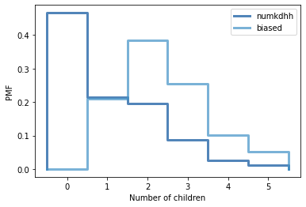

[Think Stats Chapter 3 Exercise 1](http://greenteapress.com/thinkstats2/html/thinkstats2004.html#toc31) (actual vs. biased)

**Exercise 1**  
*Something like the class size paradox appears if you survey children and ask how many children are in their family. Families with many children are more likely to appear in your sample, and families with no children have no chance to be in the sample.
Use the NSFG respondent variable NUMKDHH to construct the actual distribution for the number of children under 18 in the household.*

```python
>>> pmf = thinkstats2.Pmf(resp.numkdhh, label="numkdhh")
```

*Now compute the biased distribution we would see if we surveyed the children and asked them how many children under 18 (including themselves) are in their household.*

```python
>>> def BiasPmf(pmf, label):
        new_pmf = pmf.Copy(label=label)
    
        for x, p in pmf.Items():
            new_pmf.Mult(x, x)
    
        new_pmf.Normalize()
        return new_pmf

>>> biased_pmf = BiasPmf(pmf, "biased")
```

*Plot the actual and biased distributions, and compute their means. As a starting place, you can use ```chap03ex.ipynb```.*

```python
>>> thinkplot.PrePlot(2)
>>> thinkplot.Pmfs([pmf, biased_pmf])
>>> thinkplot.Show(xlabel="Number of children", ylabel="PMF")
```



```python
>>> print('PMF mean: ', pmf.Mean())
PMF mean:  1.024205155043831
```

```python
>>> print('Biased PMF mean: ', biased_pmf.Mean())
Biased PMF mean:  2.403679100664282
```

```python
>>> print("Probability of not having children:\n", f"Unbiased probability: {pmf.Prob(0)}", "\n", f"Biased probability: {biased_pmf.Prob(0)}")
Probability of not having children:
 Unbiased probability: 0.466178202276593 
 Biased probability: 0.0
```

If we survey children and ask how many children are in the family, we would have a biased distribution, as we can’t ask something to somebody that doesn’t exist.  
We can see this effect on the probability of having 0 (zero) children. For the biased distribution, the probability of having zero kids is ```0```, when in reality (actual distribution) the probability is ```0.46```.  
The effect is also observable in the means of each distribution. For the actual distribution, the average probability is having ```1``` kid, whereas for the biased distribution this is ```2``` kids.