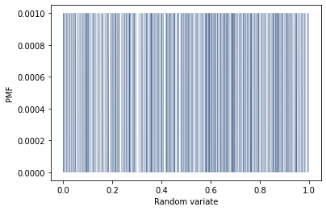
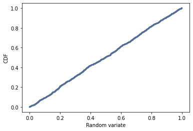

[Think Stats Chapter 4 Exercise 2](http://greenteapress.com/thinkstats2/html/thinkstats2005.html#toc41) (a random distribution)

**Exercise 2**  
*The numbers generated by random.random are supposed to be uniform between 0 and 1; that is, every value in the range should have the same probability.*  
*Generate 1000 numbers from random.random. Plot their PMF and CDF. Is the distribution uniform?*

##### 1. Generate 1000 numbers from random.random
```python
>>> nums = np.random.random(1000)
>>> nums[:10]
array([0.1889021 , 0.95947588, 0.87361158, 0.66866038, 0.58156521,
       0.44315894, 0.65223507, 0.57603283, 0.40499186, 0.71748323])
```

Every value of the array ```nums``` is a random number between 0 and 1.

##### 2. Plot the PMF (Probability Mass Distribution)
```python
>>> pmf = thinkstats2.Pmf(nums)
>>> thinkplot.Pmf(pmf, linewidth=0.1)
>>> thinkplot.Config(xlabel='Random variate', ylabel='PMF')
```



Let's take a look at the ```x-axis``` *Random variate*:
- each value is a number in ```[0, 1]```,
- **each value has the exact same probability as every other value in the dataset, ```1 / 1000``` or ```0.001```**  

The PMF is constant over the possible values of ```x```.

##### 3. Plot the CDF (Cumulative Distribution Function)

```python
>>> cdf = thinkstats2.Cdf(nums)
>>> thinkplot.Cdf(cdf)
>>> thinkplot.Config(xlabel='Random variate', ylabel='CDF')
```



It shows that for any value:
- ```F(x) = 0``` for ```x < 0``` 
- ```F(x) = x``` for ```0 <= x <= 1```
- ```F(x) = 1``` for ```x > 1```

The ```nums``` dataset checks the main characteristics of an uniform distribution U(0, 1).